# `@openclaw/voice-sdk` — Design Document

## TL;DR

`@openclaw/voice-sdk` is a provider-agnostic, media-rich, agent-first TypeScript SDK that defines a shared `Call` abstraction for real-time communication. Any channel — WhatsApp, Twilio, Google Meet, Discord, SIP — implements one interface. Any AI agent consumes one `AgentBridge`. The name "voice" is used in the telecom tradition: the SDK covers **audio, video, screen, and data** — any real-time media flowing over a call session.

---

## The Problem

OpenClaw handles dozens of messaging channels through a unified plugin SDK. But real-time calls — voice, video, group meetings — are handled ad hoc today:

- `voice-call` extension: Twilio/Telnyx/Plivo phone calls, webhook-driven, no shared abstraction
- `realtime-voice`: STT/TTS AI speech provider registry, disconnected from the call lifecycle
- `feat/googlemeet-audio-ingest`: OAuth + meeting preflight — deliberately stops short of live audio, because there is nowhere clean to plug it in

Every new call-capable channel (WhatsApp calling, Google Meet, Discord voice) reimplements the same lifecycle logic: ringing, accepting, media negotiation, agent handoff, teardown. AI agents that want to participate have no standard interface to receive transcripts or inject speech.

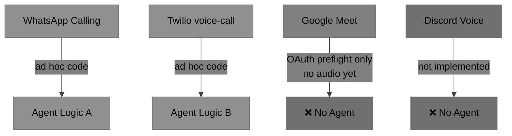

---

## The Solution

A single `VoiceProvider` interface that every transport implements. A single `Call` object with a typed state machine. A single `AgentBridge` that every AI agent consumes — regardless of whether the call came from WhatsApp, a Google Meet room, or a SIP trunk.

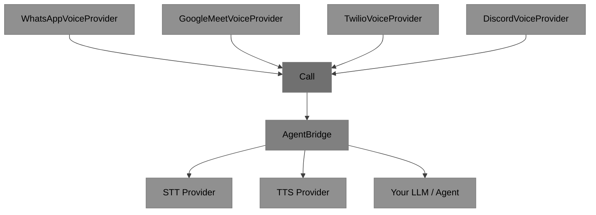

---

## Heritage: Moho, Tropo, Voxeo

The SDK design is directly inspired by the lineage of Voxeo's open-source telephony frameworks.

**Voxeo** (acquired by Enghouse) was the company behind some of the most influential VoIP developer platforms of the 2000s–2010s.

**Tropo** was Voxeo's cloud communications platform — one of the first APIs to let developers write voice applications in Python, Ruby, JavaScript, or PHP with a handful of primitives: `call()`, `answer()`, `say()`, `record()`. It made telephony programmable for web developers.

**Moho** (github.com/voxeolabs/moho) was Voxeo's open-source Java framework for SIP/XMPP media applications. It introduced the patterns `@openclaw/voice-sdk` adapts for TypeScript:

| Moho concept                                         | voice-sdk equivalent                                      |
| ---------------------------------------------------- | --------------------------------------------------------- |
| `Application` — registers for events from a `Driver` | `VoiceProvider` — registers `onCall` handler              |
| `Call` — stateful object with lifecycle events       | `Call extends EventEmitter` — `state`, `on('state', ...)` |
| `Participant` joining a `Mixer`                      | `joinGroupCall(groupId)`                                  |
| `MediaService` — `play()`, `record()`, `collect()`   | `MediaService` interface                                  |
| Verb pipeline (say → record → transfer)              | `AgentBridge` — `injectTTS()`, `injectAudio()`            |

The key idea from Moho that carries forward: **the call object is the unit of abstraction**, not the transport. You program against `Call`, and the transport is a plugin.

---

## SDK Components

```mermaid
%%{init: {'theme': 'base', 'themeVariables': {'primaryColor': '#909090', 'primaryTextColor': '#000000', 'secondaryColor': '#808080', 'tertiaryColor': '#707070', 'lineColor': '#404040'}}}%%
graph LR
    subgraph "Public API  @openclaw/voice-sdk"
        T[Types\nMediaType · CallState\nCallMode · Endpoint\nCallOptions · MediaSource]
        E[CallError\ntyped code union\nfactory methods]
        VP[VoiceProvider\ninterface]
        CA[Call\ninterface]
        AB[AgentBridge\ninterface]
        MS[MediaService\ninterface]
    end
    subgraph "providers/whatsapp"
        WCM[WhatsAppConnectionManager\ninterface]
        WVP[WhatsAppVoiceProvider]
        WC[WhatsAppCall]
        MSQ[MediaStreamQueue\npush AsyncIterable]
    end
    subgraph "providers/mock"
        MVP[MockVoiceProvider]
        MC[MockCall]
    end
    subgraph "agent-bridge"
        BAB[BaseAgentBridge\nSTT + TTS wiring]
    end
    subgraph "CLI"
        CLI[openclaw-voice\nsimulate-incoming\ndial]
    end

    VP --> WVP
    VP --> MVP
    CA --> WC
    CA --> MC
    AB --> BAB
    WCM --> WVP

    style T fill:#909090,color:#000000
    style E fill:#909090,color:#000000
    style VP fill:#808080,color:#000000
    style CA fill:#808080,color:#000000
    style AB fill:#808080,color:#000000
    style MS fill:#808080,color:#000000
    style WCM fill:#909090,color:#000000
    style WVP fill:#707070,color:#000000
    style WC fill:#707070,color:#000000
    style MSQ fill:#909090,color:#000000
    style MVP fill:#707070,color:#000000
    style MC fill:#707070,color:#000000
    style BAB fill:#707070,color:#000000
    style CLI fill:#909090,color:#000000
```

### Call Lifecycle State Machine

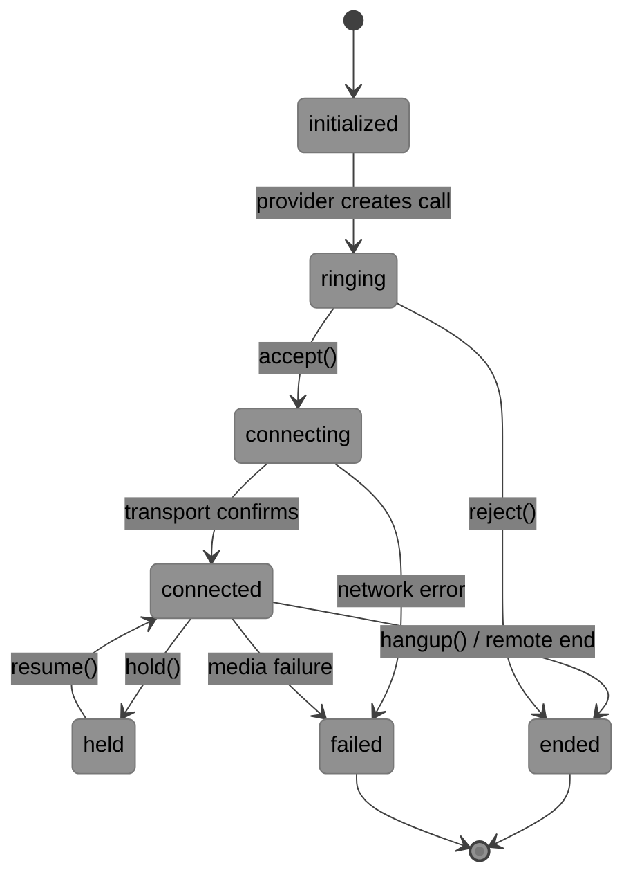

### Key Types

```ts
type MediaType = "audio" | "video" | "screen" | "data";
type CallState =
  | "initialized"
  | "ringing"
  | "connecting"
  | "connected"
  | "held"
  | "ended"
  | "failed";
type CallMode = "listen-only" | "talkback" | "full-duplex";
type MediaSource = AsyncIterable<Buffer>; // Node-native — zero DOM dependency
```

---

## Scenarios

### Scenario 1 — Inbound Call: Agent Answers and Responds

An incoming WhatsApp voice call arrives. The agent accepts, listens for speech, replies with synthesised voice.

```ts
const provider = new WhatsAppVoiceProvider(connectionManager);

provider.onCall(async (call) => {
  await call.accept({ mediaTypes: ["audio"] });

  const bridge = call.getAgentBridge();
  bridge.setSTTProvider(deepgramSTT);
  bridge.setTTSProvider(elevenLabsTTS);

  bridge.onVoiceInput(async (transcript) => {
    const reply = await myLLM.complete(transcript);
    await bridge.injectTTS(reply);
  });

  call.on("state", (state) => {
    if (state === "ended") cleanup();
  });
});
```

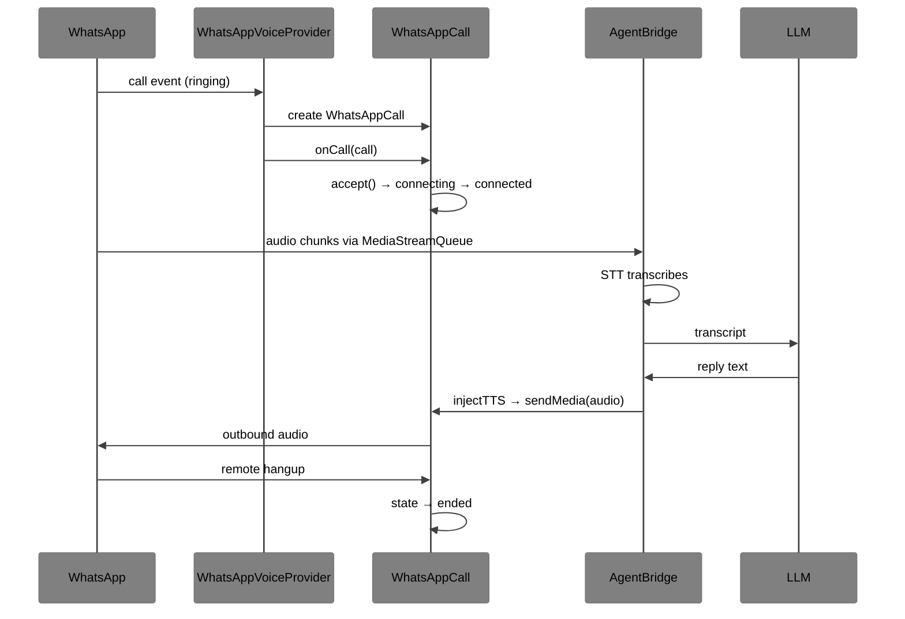

---

### Scenario 2 — Outbound Call: Agent Dials Out

The agent initiates a call to a phone number or WhatsApp JID.

```ts
const call = await provider.createCall(
  { type: "whatsapp", id: "+15550001234" },
  { mediaTypes: ["audio"], mode: "full-duplex" },
);

call.on("state", async (state) => {
  if (state === "connected") {
    await call.getAgentBridge().injectTTS("Hello, this is your OpenClaw assistant.");
  }
});
```

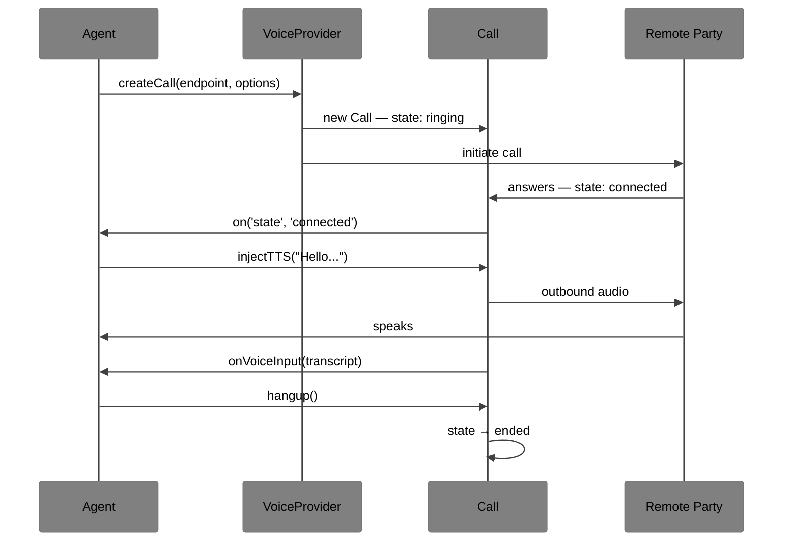

---

### Scenario 3 — Join Existing Group Call: Listen-Only, Upgrade to Speak

An agent joins a WhatsApp group call or meeting in listen-only mode, accumulates context, then speaks when summoned.

```ts
const call = await provider.joinGroupCall("group-jid@g.us", {
  mediaTypes: ["audio"],
  mode: "listen-only",
});

const bridge = call.getAgentBridge();
bridge.setSTTProvider(mySTT);

const transcript: string[] = [];
bridge.onVoiceInput((t) => transcript.push(t));

call.on("text", async (msg) => {
  if (msg.text.includes("@agent")) {
    await call.upgradeMode("talkback");
    const summary = await myLLM.summarize(transcript.join(" "));
    await bridge.injectTTS(summary);
    await call.upgradeMode("listen-only");
  }
});
```

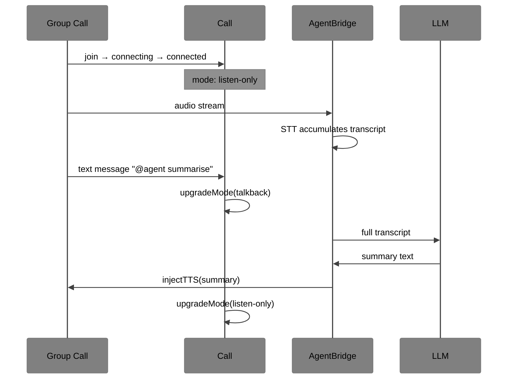

---

### Scenario 4 — Testing: Full Agent Round-Trip with MockVoiceProvider

No real network. Deterministic. Fast. Uses `MockVoiceProvider` to simulate inbound call, voice input, and TTS injection.

```ts
import { MockVoiceProvider } from "@openclaw/voice-sdk/providers/mock";
import { vi, expect } from "vitest";

const provider = new MockVoiceProvider();
const call = provider.triggerIncoming({ type: "whatsapp", id: "+1234" });
await call.accept();

const ttsSpy = vi.fn((_text: string) =>
  (async function* () {
    yield Buffer.from("tts-audio");
  })(),
);
call.getAgentBridge().setTTSProvider({ synthesize: ttsSpy });
call.getAgentBridge().onVoiceInput(async (t) => {
  await call.getAgentBridge().injectTTS(`You said: ${t}`);
});

provider.simulateVoiceInput(call.id, "book me a flight");
await new Promise((r) => setImmediate(r)); // flush async callbacks

expect(ttsSpy).toHaveBeenCalledWith("You said: book me a flight", undefined);
expect(call.getSentMedia()).toHaveLength(1);
```

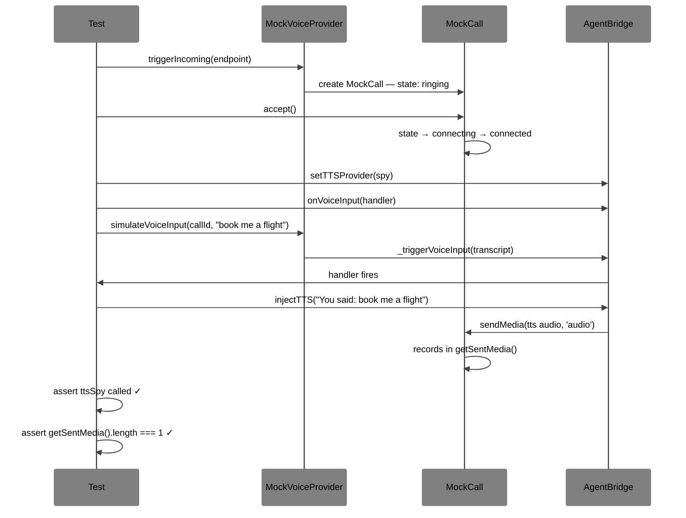

---

### Scenario 5 — Multi-Modal Upgrade: Audio → Audio + Video

A call starts audio-only. The user requests video mid-call. The agent begins processing video frames for vision.

```ts
provider.onCall(async (call) => {
  await call.accept({ mediaTypes: ["audio"] });

  call.on("text", async (msg) => {
    if (msg.text === "enable video") {
      await call.upgradeMedia(["audio", "video"]);

      const videoStream = call.getMediaStream("video");
      if (videoStream) {
        call.getAgentBridge().onVideoFrame?.(async (frame, ts) => {
          const description = await myVisionModel.describe(frame);
          await call.getAgentBridge().injectTTS(`I can see: ${description}`);
        });
      }
    }
  });
});
```

---

### Scenario 6 — Synthetic Video: Talking Avatar Injection

An agent injects a synthesised video stream (e.g. a talking avatar) into the call alongside speech.

```ts
await call.accept({ mediaTypes: ["audio", "video"] });

const reply = await myLLM.complete(transcript);

// Speak and show avatar simultaneously
await Promise.all([
  bridge.injectTTS(reply),
  bridge.injectSyntheticVideo?.(avatarEngine.render(reply)),
]);
```

---

## STT and TTS Integration

`AgentBridge` uses a clean provider pattern — no bundled STT or TTS dependencies in the core SDK. Both are swappable at runtime.

```mermaid
%%{init: {'theme': 'base', 'themeVariables': {'primaryColor': '#909090', 'primaryTextColor': '#000000', 'secondaryColor': '#808080', 'tertiaryColor': '#707070', 'lineColor': '#404040'}}}%%
graph LR
    subgraph "Inbound audio pipeline"
        MS[MediaSource\nAsyncIterable Buffer]
        STT[STTProvider\n.transcribe audio → segments]
        CB[onVoiceInput callback\ntranscript · confidence · isFinal]
    end
    subgraph "Agent"
        LLM[LLM / agent logic]
    end
    subgraph "Outbound audio pipeline"
        TTS[TTSProvider\n.synthesize text → MediaSource]
        SM[Call.sendMedia\naudio → transport]
    end

    MS -->|inbound stream| STT
    STT -->|transcript segments| CB
    CB --> LLM
    LLM -->|reply text| TTS
    TTS -->|MediaSource| SM

    style MS fill:#909090,color:#000000
    style STT fill:#808080,color:#000000
    style CB fill:#909090,color:#000000
    style LLM fill:#707070,color:#000000
    style TTS fill:#808080,color:#000000
    style SM fill:#909090,color:#000000
```

### STTProvider Interface

```ts
interface STTProvider {
  transcribe(audio: MediaSource): AsyncIterable<{
    transcript: string;
    confidence: number;
    isFinal: boolean;
  }>;
}
```

**Example — Deepgram:**

```ts
bridge.setSTTProvider({
  transcribe: async function* (audio) {
    const socket = deepgram.transcription.live({ punctuate: true });
    for await (const chunk of audio) {
      socket.send(chunk);
    }
    for await (const result of socket) {
      yield {
        transcript: result.channel.alternatives[0].transcript,
        confidence: result.channel.alternatives[0].confidence,
        isFinal: result.is_final,
      };
    }
  },
});
```

### TTSProvider Interface

```ts
interface TTSProvider {
  synthesize(text: string, options?: TTSOptions): MediaSource;
}
```

**Example — ElevenLabs:**

```ts
bridge.setTTSProvider({
  synthesize: (text, opts) =>
    elevenlabs.textToSpeechStream(text, {
      voice_id: opts?.voice ?? "rachel",
      model_id: "eleven_turbo_v2",
    }),
});
```

### Relationship to OpenClaw's `realtime-voice`

OpenClaw already has a `RealtimeVoiceBridge` pattern in `src/realtime-voice/`. The mapping is direct:

| `realtime-voice`                                | `voice-sdk`                                        |
| ----------------------------------------------- | -------------------------------------------------- |
| `RealtimeVoiceBridgeCallbacks.onAudio(muLaw)`   | `STTProvider.transcribe(audio)` yields segments    |
| `RealtimeVoiceBridge.sendAudio(audio)`          | `AgentBridge.injectAudio(stream)`                  |
| `onTranscript(role, text, isFinal)`             | `AgentBridge.onVoiceInput(transcript, confidence)` |
| Provider resolved via `realtime-voice` registry | `setSTTProvider(p)` / `setTTSProvider(p)`          |

A thin adapter wrapping `RealtimeVoiceBridge` as a `TTSProvider`/`STTProvider` pair is the bridge between the two systems — no changes needed to either.

---

## How This Fits `feat/googlemeet-audio-ingest`

Vincent and Peter's branch is the **control plane** for Google Meet. `@openclaw/voice-sdk` is the **call abstraction layer** that sits above it. The two halves fit together without overlap.

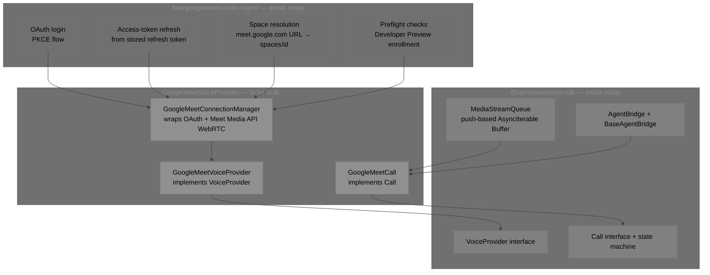

### The Binding Point

The `feat/googlemeet-audio-ingest` branch explicitly scopes out live audio capture:

> _"Google's Meet Media API currently exposes a browser or native-client media surface, so this first plugin release lands the control plane first instead of pretending the audio path is finished."_

The `MediaStreamQueue` in `@openclaw/voice-sdk` is exactly the missing piece. Once the Meet Media API WebRTC stream is accessible, it feeds `Buffer` chunks into a `MediaStreamQueue`, which satisfies `MediaSource = AsyncIterable<Buffer>` — and the full AgentBridge pipeline works without any changes to the voice-sdk core.

### Function-Level Mapping

| `feat/googlemeet-audio-ingest`               | `GoogleMeetConnectionManager` role                               |
| -------------------------------------------- | ---------------------------------------------------------------- |
| `resolveGoogleMeetAccessToken(opts)`         | Called in `constructor` and `joinGroupCall` to get a valid token |
| `fetchGoogleMeetSpace(accessToken, meeting)` | Called in `joinGroupCall` to resolve the space name              |
| `buildGoogleMeetPreflightReport(...)`        | Called pre-join to surface blockers before creating a Call       |
| Meet Media API WebRTC stream _(pending)_     | Pushes `Buffer` chunks to `MediaStreamQueue`                     |

### Integration Flow

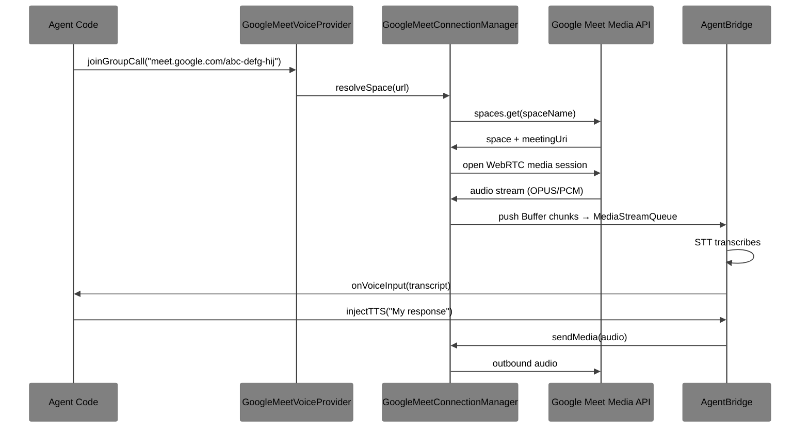

---

## Conclusion & Next Steps

### Single-Provider MVP

The immediate next step is `@openclaw/google-meet-provider` — a single focused package with no changes to the voice-sdk core:

1. **`GoogleMeetConnectionManager`** — wraps the existing branch's OAuth/space-resolution utilities, opens the Meet Media API session, routes audio to `MediaStreamQueue`
2. **`GoogleMeetCall`** — implements `Call`, backed by the manager and a `MediaStreamQueue` per active media type
3. **`GoogleMeetVoiceProvider implements VoiceProvider`** — `joinGroupCall(meetUrl)` resolves the space, runs preflight, returns a `GoogleMeetCall` in `connecting` state

### Incremental Phases

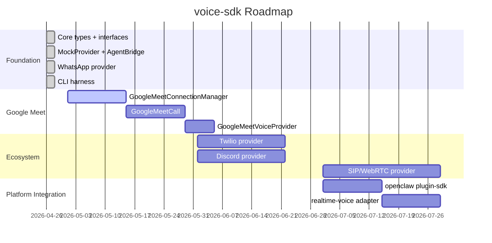

### End Goals

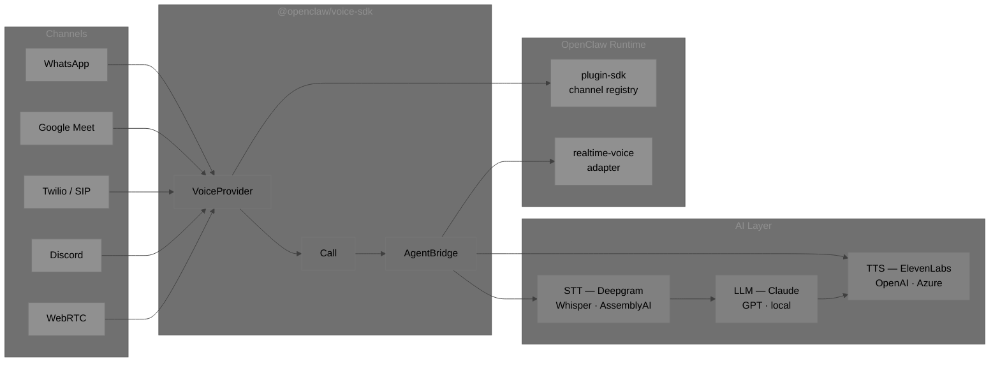

| Goal                                | Description                                                                                                          |
| ----------------------------------- | -------------------------------------------------------------------------------------------------------------------- |
| **Unified call surface**            | Every real-time call in OpenClaw — phone, WhatsApp, Meet, Discord — goes through one `Call` interface                |
| **Agent-first by default**          | Every call has an `AgentBridge` with pluggable STT/TTS; no per-provider agent wiring                                 |
| **OpenClaw plugin-sdk integration** | `VoiceProvider` registered via the plugin system, resolved from config like `realtime-voice` providers today         |
| **Provider ecosystem**              | `@openclaw/whatsapp-voice`, `@openclaw/google-meet-voice`, `@openclaw/twilio-voice` as separate installable packages |
| **Zero DOM, zero lock-in**          | `MediaSource = AsyncIterable<Buffer>` keeps everything Node-native; no WebRTC browser dependencies in core           |

The voice-sdk is the shared contract. Everything else is a provider.

---

_Generated: 2026-04-26 | Repo: github.com/openclaw/voice-sdk_
